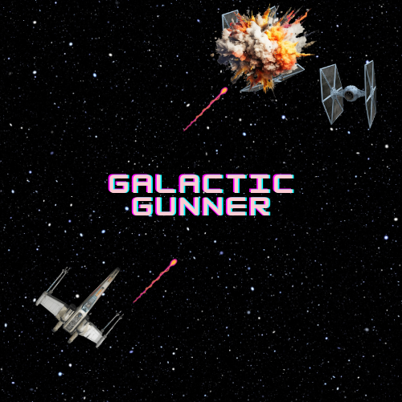
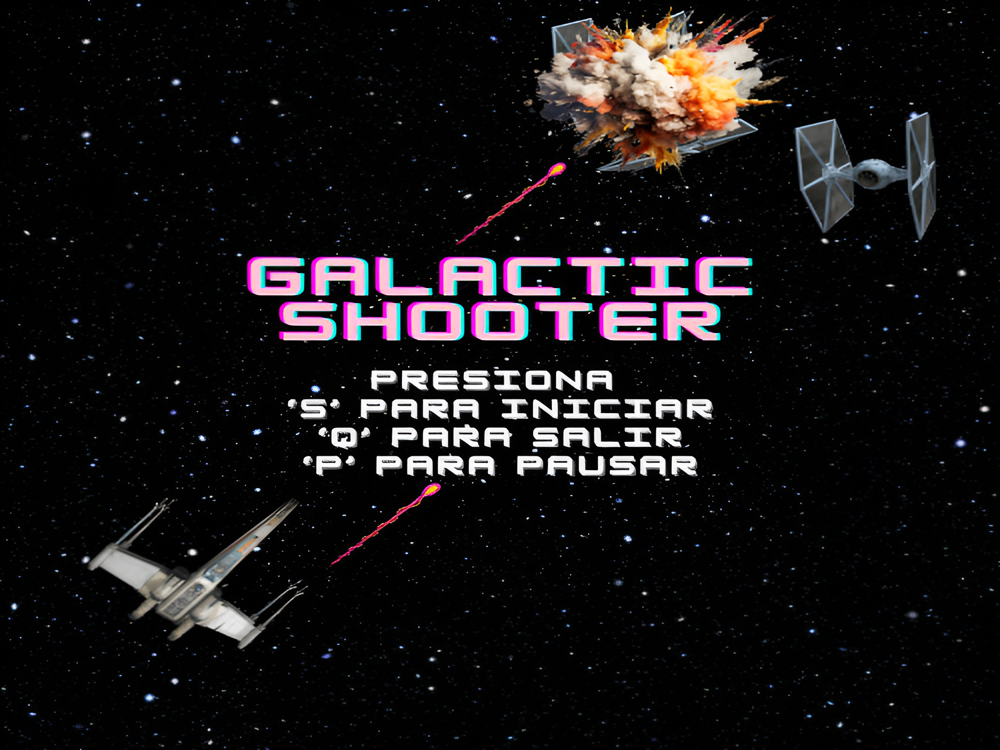
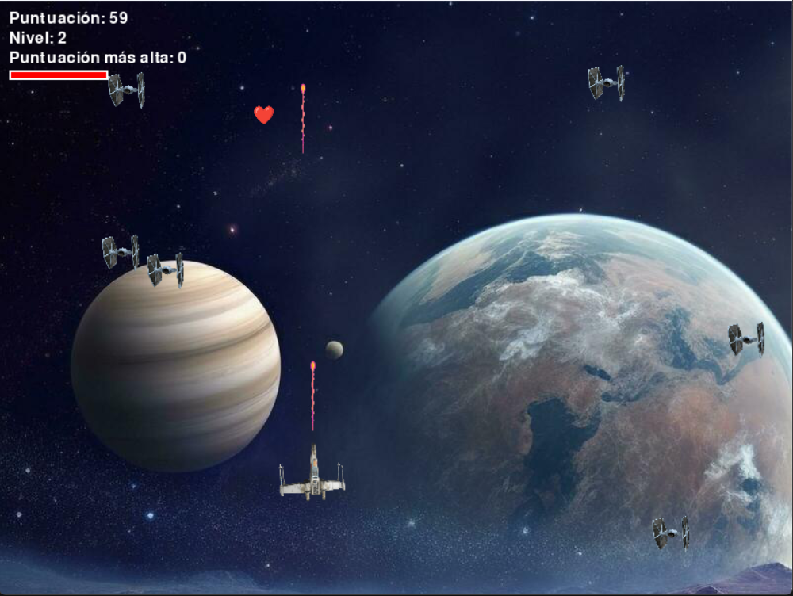
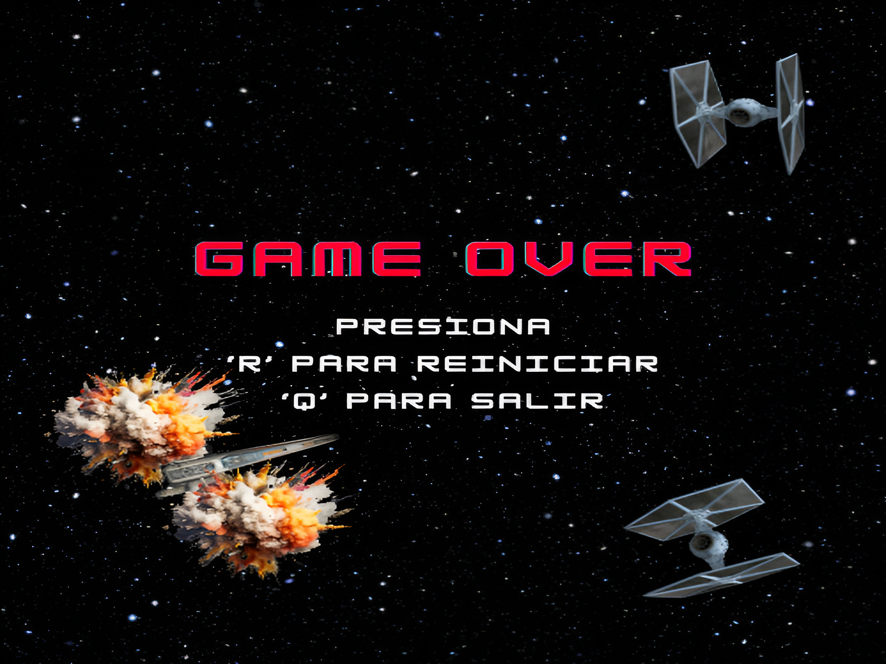

# Galactic Shooter

**Galactic Shooter** es un juego de disparos en 2D donde controlas una nave espacial para destruir enemigos en el espacio mientras intentas sobrevivir el mayor tiempo posible. Enfréntate a oleadas de enemigos y trata de conseguir la mayor puntuación posible. ¡Buena suerte, piloto espacial!

## Características

- **Género:** Juego de disparos en 2D.
- **Modo de juego:** Sobrevive el mayor tiempo posible enfrentándote a enemigos que aparecen en pantalla.
- **Controles:**
  - Flechas del teclado para moverte.
  - Barra espaciadora para disparar.

## Instalación y ejecución

1. **Descarga el juego:** [Enlace de descarga en itch.io](https://parcivaldev.itch.io/galacticshooter)
2. **Ejecución:** Una vez descargado, descomprime el archivo ZIP y ejecuta el archivo `.exe` (o el archivo principal si usas otro sistema operativo).
   
   Si es necesario, asegúrate de tener las librerías necesarias instaladas, como [Pygame](https://www.pygame.org/news).

## Capturas de pantalla

    
    
    

> [!NOTE]
Este proyecto fue desarrollado siguiendo el tutorial en video: [Crea un juego de naves espaciales con Python y Pygame](https://www.youtube.com/watch?v=fGM9Zj7vrBo y **ChatGPT**.

